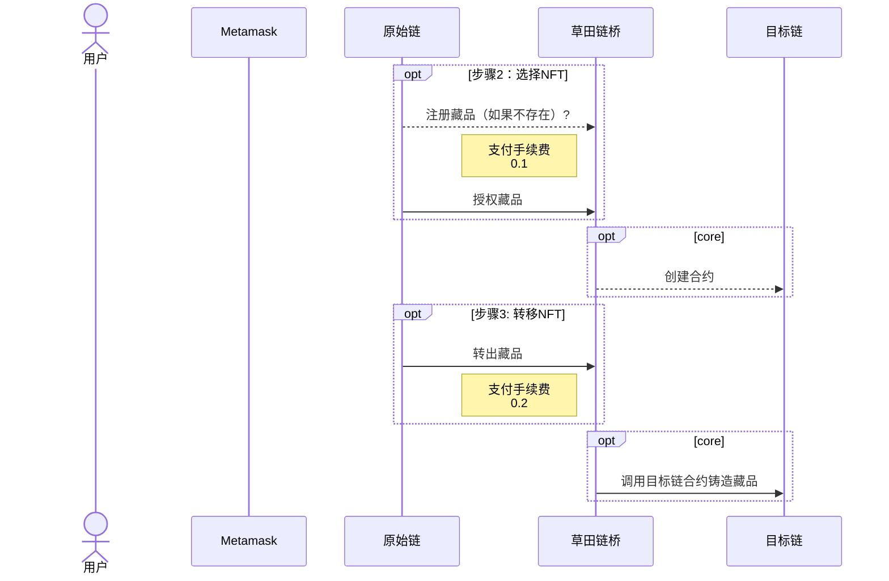
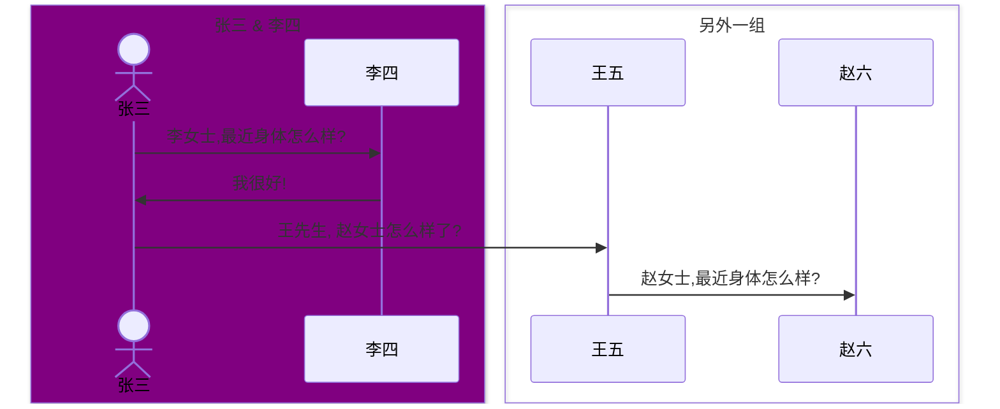

## 跨链结构图(顺序图)

```mermaid
sequenceDiagram
    actor 用户
        participant Metamask
    participant 原始链
    participant 草田链桥
    participant 目标链
    
    opt 步骤2：选择NFT
    原始链-->>草田链桥: 注册藏品（如果不存在）?
    Note left of 草田链桥: 支付手续费 <br/> 0.1
    原始链->>草田链桥: 授权藏品
    end
    opt core
       草田链桥-->>目标链: 创建合约
    end

    opt 步骤3: 转移NFT
        原始链->>草田链桥: 转出藏品
        Note left of 草田链桥: 支付手续费 <br/> 0.2
    end

    opt core
         草田链桥->>目标链: 调用目标链合约铸造藏品
    end

```

```mermaid
sequenceDiagram
   box Purple 张三 & 李四
   actor  张三
   participant 李四
   end
   box 另外一组
   participant 王五
   participant 赵六
   end
   张三->>李四: 李女士,最近身体怎么样?
   李四->>张三: 我很好!
   张三->>王五: 王先生, 赵女士怎么样了?
   王五->>赵六: 赵女士,最近身体怎么样?

```
